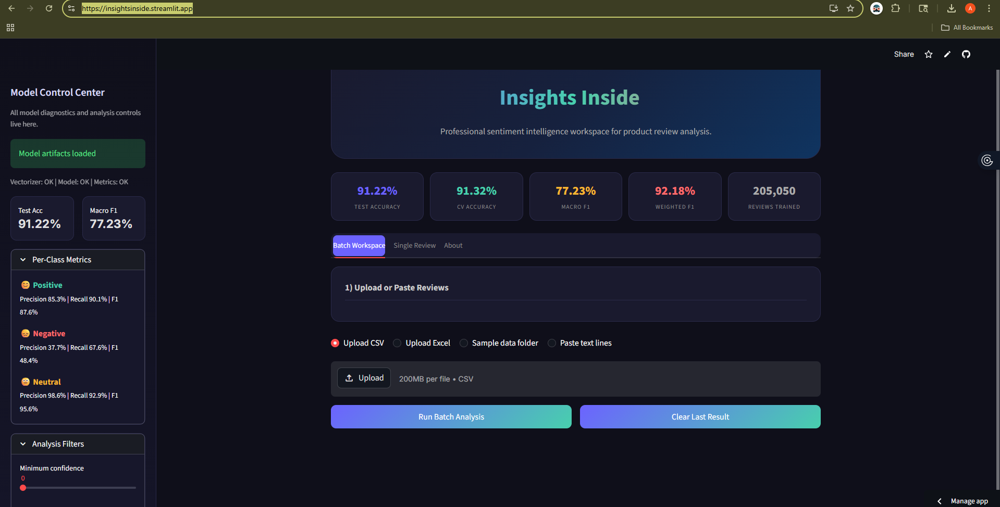

# 🔍 Insights Inside

## 🖼️ Live Application Preview  

<p align="center">
  
</p>

### AI-Powered Sentiment Intelligence Platform for Product Reviews

🌐 **Live App:** https://insightsinside.streamlit.app/
📂 **Repository:** https://github.com/ashish6123/Insights_Inside

---

## 📌 Overview

**Insights Inside** is a full-stack Machine Learning application designed to analyze and classify product reviews into **Positive, Negative, or Neutral sentiments** with high accuracy.

Built with a focus on **real-world usability**, this project combines:

* ⚙️ Production-ready ML pipeline
* 🎯 Advanced evaluation metrics
* 🎨 Modern dashboard UI (Streamlit-based)

---

## ✨ Key Features

### 🧠 Machine Learning

* Logistic Regression + TF-IDF (bigrams)
* Trained on **200K+ real-world reviews**
* Balanced class handling
* Confidence scoring + probability outputs

### 📊 Model Insights Dashboard

* Test Accuracy, CV Accuracy, Macro F1, Weighted F1
* Per-class metrics (Precision, Recall, F1)
* Confidence distribution & visual analytics
* Model evaluation charts (CV, confusion matrix)

### 🧪 Batch Analysis

* Upload CSV / Excel files
* Paste multiple reviews
* Sample datasets included
* Export results (CSV & Excel)

### ⚡ Single Review Analysis

* Real-time prediction
* Probability breakdown visualization
* Trust Score (Confidence × Class F1)

### 🎛️ Model Control Center (Sidebar)

* Model health monitoring
* Training stats & dataset split
* Adjustable confidence filters
* Clean, SaaS-style UI

---

## 🖼️ Application Preview

> A professional sentiment intelligence workspace with dashboard, charts, and interactive analysis tools.

---

## 🏗️ Tech Stack

| Category      | Technology        |
| ------------- | ----------------- |
| Frontend      | Streamlit         |
| Backend       | Python            |
| ML            | scikit-learn      |
| NLP           | TF-IDF Vectorizer |
| Visualization | Matplotlib        |
| Data Handling | Pandas, NumPy     |

---

## 📂 Project Structure

```
Insights_Inside/
│
├── app.py                      # Main Streamlit application
├── sentiment_utils.py          # Prediction helpers
├── train_model.py              # Model training script
├── requirements.txt            # Dependencies
│
├── model/
│   ├── tfidf_vectorizer.pkl
│   └── sentiment_model.pkl
│
├── evaluation/
│   ├── metrics_summary.json
│   ├── confusion_matrix.png
│   ├── metrics_chart.png
│   └── classification_report.txt
│
├── sample_data/
│   ├── sample_reviews.csv
│   └── dataset_part_*.csv
│
└── README.md
```

---

## 📈 Model Performance

| Metric        | Score |
| ------------- | ----- |
| Test Accuracy | ~91%  |
| CV Accuracy   | ~91%  |
| Macro F1      | ~77%  |
| Weighted F1   | ~92%  |

> ⚠️ Dataset is imbalanced → Macro F1 highlights real performance.

---

## ⚙️ Installation & Setup

### 1️⃣ Clone the repository

```bash
git clone https://github.com/ashish6123/Insights_Inside.git
cd Insights_Inside
```

### 2️⃣ Install dependencies

```bash
pip install -r requirements.txt
```

### 3️⃣ Run the app

```bash
streamlit run app.py
```

---

## 📊 How It Works

1. Input reviews (file upload / text input)
2. Text preprocessing (cleaning + normalization)
3. TF-IDF vectorization
4. Logistic Regression prediction
5. Output:

   * Sentiment
   * Confidence %
   * Class probabilities

---

## 🎯 Use Cases

* 🛒 E-commerce review analysis
* 📢 Customer feedback insights
* 🧾 Product quality monitoring
* 🤖 NLP portfolio project

---

## 🚀 What Makes This Project Stand Out

✔ Clean, production-style UI
✔ Full ML pipeline + evaluation
✔ Real dataset (200K+ samples)
✔ Business-oriented insights (not just predictions)
✔ Interactive analytics dashboard

---

## 🧠 Future Improvements

* Deep Learning models (BERT / LSTM)
* API integration (FastAPI backend)
* User authentication system
* Real-time streaming analysis
* Cloud deployment (AWS / GCP)

---

## 👨‍💻 Author

**Ashish Kumar**

* 💼 Aspiring AI/ML Engineer
* 🔗 GitHub: https://github.com/ashish6123

---

## ⭐ Support

If you found this project useful:
👉 Star the repo
👉 Share with others

---

## 📜 License

This project is for educational and portfolio purposes.
